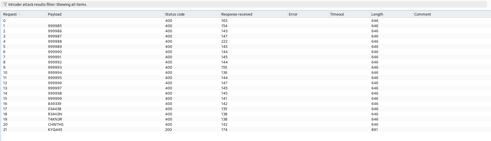

> *"The street finds its own uses for things."* — William Gibson

## How I Got Here

In late 2024 I scoped out an engagement for [Radically Open Security](https://www.radicallyopensecurity.com/) targeting [django-allauth](https://github.com/pennersr/django-allauth) — one of the most widely-used authentication libraries for Django. The audit was funded by [NLnet](https://nlnet.nl/project/django-allauth/) as part of the NGI Zero Entrust programme, and focused on newly added features: Passkey WebAuthN support, login by code, email verification by code, and the `allauth.headless` API.

Six days of work — two days code reading, one day static analysis with Snyk and Bandit, two days API testing, one day reporting. The audit ran from October 18 to November 11, 2024.

* * *

## Background

django-allauth handles authentication, registration, account management, and social login for Django applications. It's the go-to library when you need anything beyond Django's built-in auth — email verification, OAuth providers, multi-factor authentication, passkeys.

One of the newer features is email verification by code: instead of clicking a link in an email, the user enters a short alphanumeric code. It's a UX improvement — works across devices, no email client gymnastics. But short codes come with a classic problem: they need to be short enough to type but resistant enough to bruteforce. The compensating control is rate limiting. django-allauth provides `ACCOUNT_EMAIL_VERIFICATION_BY_CODE_MAX_ATTEMPTS` (default: 3) to cap how many guesses a user gets before the verification is aborted. The question is whether it actually works.

* * *

## The Code

The verification code is generated in `allauth/account/adapter.py`:

```python
def _generate_code(self):
    forbidden_chars = "0OI18B2ZAEU"
    allowed_chars = string.ascii_uppercase + string.digits
    for ch in forbidden_chars:
        allowed_chars = allowed_chars.replace(ch, "")
    return get_random_string(length=6, allowed_chars=allowed_chars)
```

The `forbidden_chars` removal is a usability choice — it strips characters that look similar (`0`/`O`, `1`/`I`, `8`/`B`, etc.) to reduce user input errors. After removing 11 characters from the 36 alphanumeric set, 25 remain. A 6-character code drawn from 25 characters gives 25^6 = **244,140,625** possible combinations.

244 million codes sounds like a large keyspace, but without rate limiting an attacker can send thousands of requests per second against the headless API. The entire keyspace becomes exhaustible in hours, and the expected number of attempts to find the correct code is half that — roughly 122 million requests. In practice, with parallelism, much less.

* * *

## The Rate Limit That Wasn't

During the API testing phase I pointed Burp Suite at the headless API endpoint for email verification by code. The configuration was clear — `ACCOUNT_EMAIL_VERIFICATION_BY_CODE_MAX_ATTEMPTS` defaults to 3. After three wrong guesses, the code should be invalidated.

I sent the first three wrong codes. Then a fourth. Then a tenth. Then twenty. The endpoint kept accepting attempts — every wrong code returned a 400 with a consistent response body, and no lockout ever triggered. On attempt 21, the correct code was submitted and the endpoint returned a 200.

<figure>
  
  <figcaption>Burp Intruder: 20 failed attempts (400), then a successful code match (200) — the rate limit never kicked in</figcaption>
</figure>

The setting existed. It had a sensible default. It was documented. It just wasn't enforced in the headless API flow. The regular (non-headless) flow had received a rate limit fix in [a September 2024 commit](https://github.com/pennersr/django-allauth/commit/02618e497f43f228a9d5319ec6c0a215ab74a1ca), but the headless API code path was missed entirely.

* * *

## Impact

When `LOGIN_BY_CODE` is enabled in an allauth configuration, an attacker can take over an account by providing the victim's email address and bruteforcing the verification code. No password needed — just HTTP requests to the headless API. Additionally, an attacker can create an account with an email they don't control, bruteforce the verification code, and end up with a "verified" account — bypassing the fundamental purpose of email verification.

This was the only High-severity finding in the audit (1 High, 3 Moderate, 4 Low, 1 Unknown across 9 findings total).

* * *

## The Fix

The fix landed as commit [`e7723ba2`](https://github.com/pennersr/django-allauth/commit/e7723ba261e0013814002d16c9436850c74bedc7) on November 7, 2024 — during the audit period — and shipped in django-allauth **65.2.0**. The headless verification endpoint now returns a **409** when `ACCOUNT_EMAIL_VERIFICATION_BY_CODE_MAX_ATTEMPTS` is exceeded, aborting the pending verification. The vulnerable code path was introduced in [`5dd84331`](https://github.com/pennersr/django-allauth/commit/5dd84331722b0bfcdb49d826828b1920b787ba83) when headless email verification by code was first added in August 2024.

* * *

## Timeline

| Date | Event |
|---|---|
| 2024-08-16 | Headless email verification by code [added](https://github.com/pennersr/django-allauth/commit/5dd84331722b0bfcdb49d826828b1920b787ba83) without max attempts enforcement |
| 2024-09-26 | Rate limit handling [fixed](https://github.com/pennersr/django-allauth/commit/02618e497f43f228a9d5319ec6c0a215ab74a1ca) for non-headless flow (headless still vulnerable) |
| 2024-10-18 | Code audit begins |
| 2024-11-07 | Max attempts enforcement [fixed](https://github.com/pennersr/django-allauth/commit/e7723ba261e0013814002d16c9436850c74bedc7) for headless flow, released in 65.2.0 |
| 2024-11-11 | Code audit concludes |
| 2024-11-21 | Final report (v1.0) delivered |

* * *

## References

- [django-allauth](https://github.com/pennersr/django-allauth) — GitHub mirror (primary repo on [Codeberg](https://codeberg.org/allauth/django-allauth))
- [django-allauth 65.2.0 release notes](https://docs.allauth.org/en/dev/release-notes/2024.html) — security notice for the fix
- [NLnet — django-allauth project](https://nlnet.nl/project/django-allauth/) — NGI Zero Entrust funding
- [CWE-307: Improper Restriction of Excessive Authentication Attempts](https://cwe.mitre.org/data/definitions/307.html)

* * *

*Responsible disclosure was followed throughout. The fix was released during the audit period.*

*Thanks to [Radically Open Security](https://www.radicallyopensecurity.com/) for the engagement, and to [NLnet](https://nlnet.nl/) for funding the audit.*
